# Hello! 

This is a Condo Miniapps playground for iOS, it is still under development, but already allows you to feel the real process of interaction with the application.

You can find the Cordova app itself in the MainCordovaApplication folder, where in the www folder there is an example of interaction with the native api and you can develop something of your own.

___

# Important! Known issues.

1. Some inputs may not work until you call the corresponding setInputsEnabled(true) method. Don't forget to disable this when the user leaves the screen where the required inputs are located.

___

# Content.

1. [Getting started](#getting_started)
2. [Important differences.](#important_differences)
3. [Working with user input.](#working_with_user_input)
4. [Navigation system.](#navigation_system)
5. [Environment.](#environment)
6. [Testing.](#testing)

    6.1 [Testing in Demo environment](#testing-demo)
    
    6.2 [Testing in Production environment](#testing-production)
7. [Publishing.](#publishing)
8. [Plugin addition.](#plugin_addition)
9. [Common methods.](#common_methods)

---

# Getting started. <a name="getting_started"></a>

1. Installing the necessary dependencies:

    - Make sure you have the latest version of the Mac OS, Xcode, and Xcode CLT installed

    - Make sure that the desired Xcode CLTs are selected, this can be done in the Xcode settings: 

        Xcode -> Preferences -> Locations -> Command Line Tools

    - Homebrew installation

        ```
        /bin/bash -c "$(curl -fsSL https://raw.githubusercontent.com/Homebrew/install/HEAD/install.sh)"
        ```
        
        then run the three commands suggested in the terminal to add homebrew to the environment variables

        ```
        echo '# Set PATH, MANPATH, etc., for Homebrew.' >> ~/.zprofile
        echo 'eval "$(/opt/homebrew/bin/brew shellenv)"' >> ~/.zprofile
        eval "$(/opt/homebrew/bin/brew shellenv)"
        ```

    - Cocoapods installation

        ```
        brew install cocoapods
        ```

        Note that the installation is not done in the recommended way, but through a third-party package manager. If you install it using any other method, you may encounter errors when working with modern hardware.

    - Installing NVM or Node.JS with npm (or yarn) package manager

        https://github.com/nvm-sh/nvm#installing-and-updating

    - Install Cordova and required packages
  
        ```
        cd MainCordovaApplication
        npm install
        ```

        You can also use the command `yarn install` if you use Yarn as your package manager.

2. Editing the application

    - Open the project directory and navigate to the `./MainCordovaApplication/www` subdirectory, where you will find the application code. Feel free to make any necessary edits.
    
    - After editing the code in the MainCordovaApplication directory, run the command

        ```
        npm run cordova prepare ios
        ```
        
        You can also use the command `yarn cordova prepare ios` if you use Yarn as your package manager. Alternatively, you can use the `cordova prepare ios` command if you have Cordova installed globally, following the official instructions.
    
3. Launching and testing the application

    - In the main project directory, execute the following command:

        ```
        pod install
        ```

        This command needs to be executed only once, before the first run.
    
    - In the main project directory, locate and open the file named 'CordovaDemoApp.xcworkspace'. Please take note of the file extension.

    - After you have opened the project in Xcode, proceed to run it.

        ```
        cmd + R
        ```

4. Optimizing
    
    So that you don't have to run the Cordova prepare ios command in the terminal after each code change, you can set it to work automatically when you start the project in Xcode. To do this, do the following steps:

    - open the project in Xcode
    - in the project navigator tab (cmd + 1) select the topmost node named CordovaDemoApp, it will have a blue square icon with the App Store icon
    - select CordovaDemoApp in the TARGETS subsection
    - open the Build Phases tab
    - expand the 4th element in the list that opens called "Run Script"
    - add there a line by the example from the comment

        ```
        path/to/installed/cordova prepare ios
        ```
       
        after that, each time you start the project, the corresponding command will be executed automatically.

---

# Important differences. <a name="important_differences"></a>

Unlike the standard Cordova, our application uses an additional configuration file, which must be located in the www directory and named **native_config.json**

This file is a json file and may contain the following fields:

1. presentationStyle - application display type, required, should be set to **native**
2. mobile_permissions - An array of strings describing the necessary permissions for the application to work. the array can contain the following values: **record_audio**, **camera**, **audio_settings**

---

# Working with user input. <a name="working_with_user_input"></a>

We try to mimic our mini-apps to the native app as much as possible. Unfortunately on **iOS** this can have a negative impact on some controls that require focus. If you notice issues with the components you are using, on the screen where they are being used and only while they are being displayed/used you need to enable additional webkit events by calling the method:

`function setInputsEnabled(enabled, success, error)`

example:

```
cordova.plugins.condo.setInputsEnabled(true, function(response) {}, function(error) {});
```

Important! Don't forget to disable this back when the user leaves the screen where the inputs that required it are located.

example:

```
cordova.plugins.condo.setInputsEnabled(false, function(response) {}, function(error) {});
```

---

# Navigation system. <a name="navigation_system"></a>

We provide native navigation for your minapps with js code side control. Each miniapp launches with a system navigation bar and a close button on it. In general, you can implement everything else on your side, make an additional panel or controls for nested navigation and work with them. 

But we **strongly recommend** to do otherwise. You can control what the system navigation bar shows on your side. This is achieved by using the following methods on history object inside condo plugin:

- Add a new item to the navigation stack:

    `function pushState(state, title)`

    example:

    ```
    cordova.plugins.condo.history.pushState({"StateKey": "StateValue"}, "Title for navigation bar");
    ```

- Replace the current item in the navigation stack:

    `function replaceState(state, title)`

    example:

    ```
    cordova.plugins.condo.history.replaceState({"StateKey": "StateValue"}, "Title for navigation bar");
    ```

- Take a step back:

    `function back()`

    example:

    ```
    cordova.plugins.condo.history.back();
    ```

- Take a few steps back:

    `function go(amount)`

    example:

    ```
    cordova.plugins.condo.history.go(-1);
    ```

    Note that unlike the system history object, the parameter passed here is always negative and can only lead backwards. We have no possibility to go forward to the place we came back from.
    
**Note**: you can make the titles on your side big and beautiful and always pass the title blank to the methods above.
    
In addition, you need to recognize when a user has pressed the system back button. This is achieved by subscribing to the already existing Cordova backbutton event https://cordova.apache.org/docs/en/12.x/cordova/events/events.html#backbutton This event is called for the system button on iOS as well.

```
document.addEventListener("backbutton", onBackKeyDown, false);

function onBackKeyDown() {
    // Handle the back button
}
```

And of course after all these changes you can get the State that is now showing on the navigation bar. This is done similarly to the standard system method - by subscribing to the condoPopstate event:
```
addEventListener("condoPopstate", (event) => {console.log("condoPopstate => ", JSON.stringify(event.state));});
```

---

# Environment. <a name="environment"></a>

The plugin provides a **hostApplication** object that can synchronously output information about the current environment in which the mini-app is running.

- Find out whether the application is looking at the production server or not:

    `function isDemoEnvironment()`

    example:

    ```
    console.log(cordova.plugins.condo.hostApplication.isDemoEnvironment());
    ```

- The base address of the current server:

    `function baseURL()`

    example:

    ```
    console.log(cordova.plugins.condo.hostApplication.baseURL());
    ```

- Main application installation ID:

    `function installationID()`

    example:

    ```
    console.log(cordova.plugins.condo.hostApplication.installationID());
    ```

- Device ID:

    `function deviceID()`

    example:

    ```
    console.log(cordova.plugins.condo.hostApplication.deviceID());
    ```

- Application locale:

    `function locale()`

    example:

    ```
    console.log(cordova.plugins.condo.hostApplication.locale());
    ```

---

# Testing(as of November 1, 2022).  <a name="testing"></a>

## Demo environment  <a name="testing-demo"></a>

1. Open safari on the device running the simulator with your application inside the CordovaDemoApp
2. Open safari settings
    
    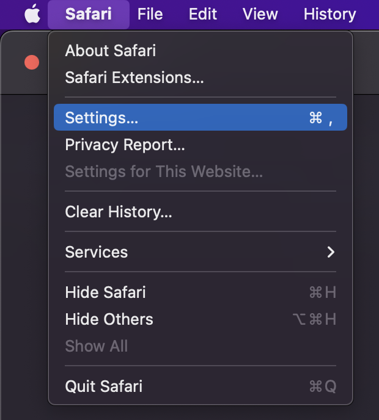
3. Open the Advanced tab and activate the "Show Develop menu in menu bar" setting
    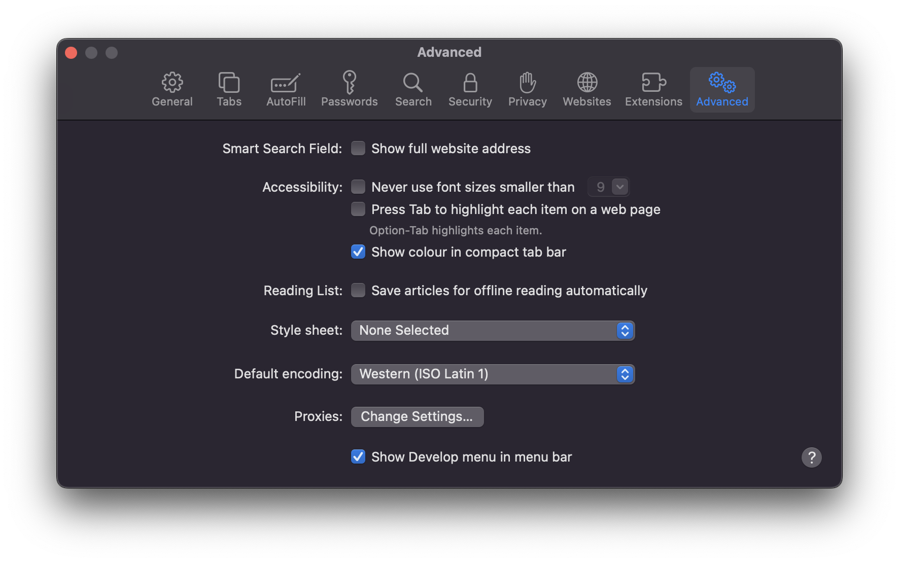
4. Open the Develop menu in Safari, find your simulator and select your mini-application there.
    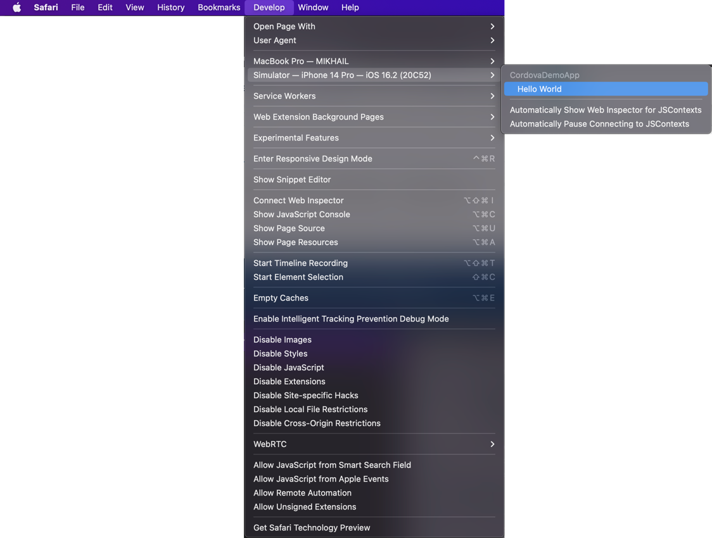
5. The standard Safari debugging tools connected to your mini-application will open
    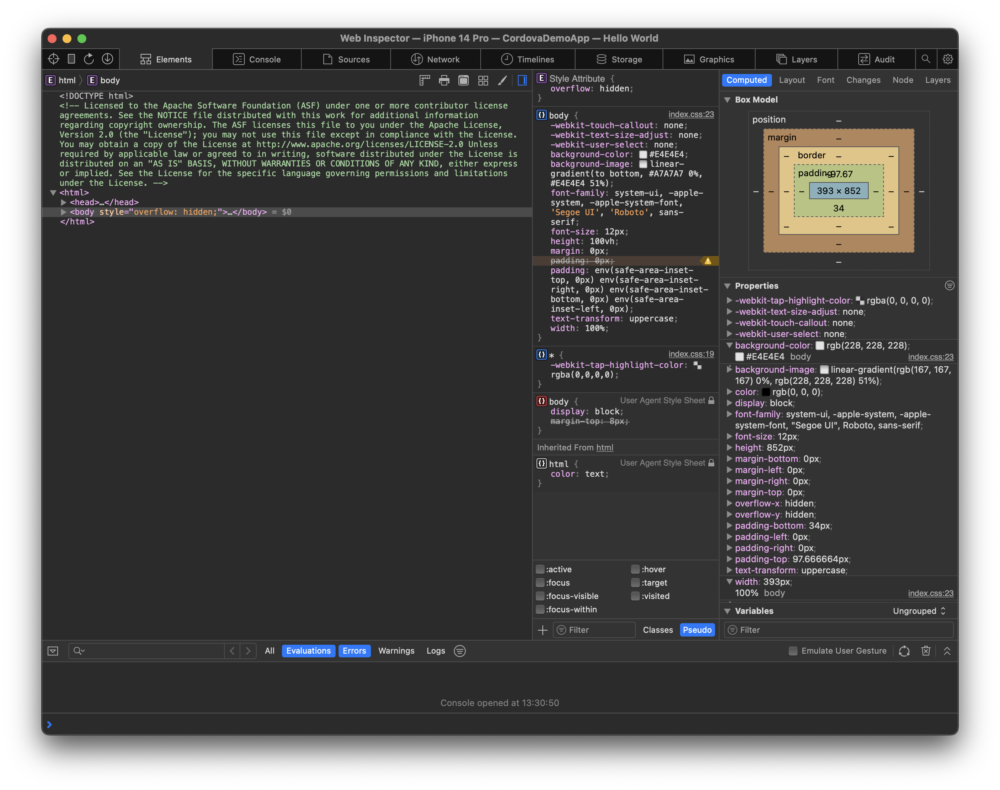

## Production environment  <a name="testing-production"></a>

1.  Open the project directory and navigate to the subdirectory `./MainCordovaApplication/platforms/ios/`
    
    In it you will find the www directory.
    
    Create a zip archive from the www directory by right-clicking on the folder and selecting Compress "www".

3. Place the resulting archive in the iCloud storage of the account connected to the device on which you will be testing the application.

4. Install the Doma app from the AppStore and log in to it

    https://apps.apple.com/us/app/doma/id1573897686

6. The app you downloaded has built-in functionality for debugging mini-applications. To turn it on and off, you use links to open it on your device:
    
    - Switching on:

        ```
        ai.doma.client.service://miniapps/local/enable
        ```
        
    - Switching off:
  
        ```            
        ai.doma.client.service://miniapps/local/disable
        ```

7. Now, on the main application screen in the list of mini-applications, the last button allows you to download or replace a previously downloaded mini-application from files. When you click on it, you need to select the previously downloaded archive in iCloud.

8. The application loaded in this way has a built-in js console, which is accessible by clicking on the button at the bottom right of the open mini-application and is able to show a lot of additional information, including various errors.


---
# Publishing <a name="publishing"></a>
To publish the mini-application, send the archive you received during the testing phase to the people at Doma with whom you interact. 


---
# Plugin addition. <a name="plugin_addition"></a>
using the Device plugin as an example

1. Adding a plugin to the Cordova project

```
cd MainCordovaApplication
npm run cordova plugin add cordova-plugin-device
# or `yarn cordova plugin add cordova-plugin-device` if you are using Yarn as your package manager
```

2. Adding native code to the main project
- open the plugins directory
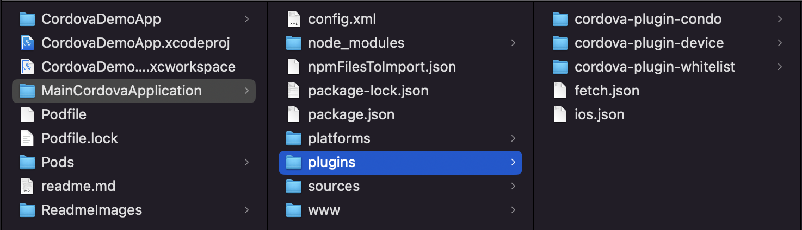

- drag and drop the directory of the new plugin into the plugins directory of the main project
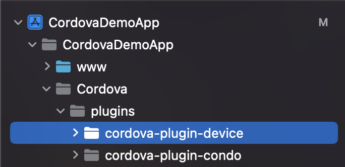

- expand the resulting directory and select everything except the src/ios directory
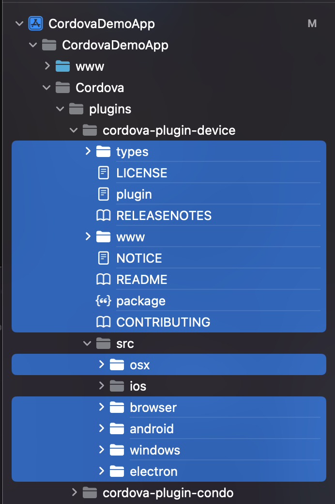

- press delete and select Remove References
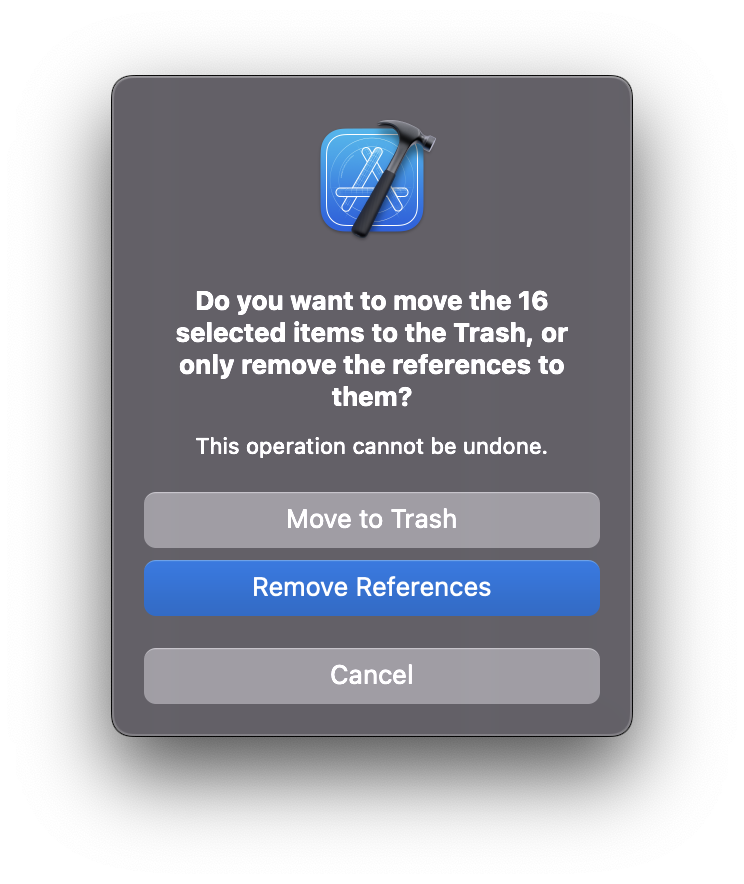

3. Adding a dependency
- open `./MainCordovaApplication/platforms/ios/HelloCordova/config.xml` file

- select and copy everything new that was added when installing the plugin
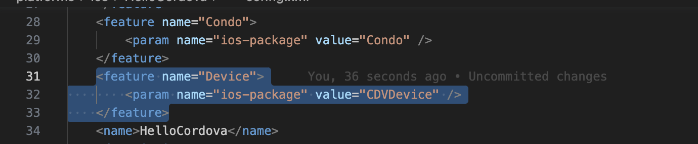

- Paste this into the appropriate places in the Cordova/config file of the main project
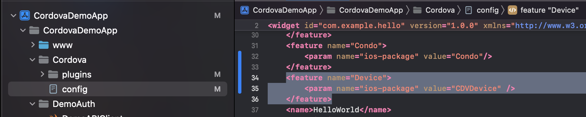

4. just need to write some code and check how it works
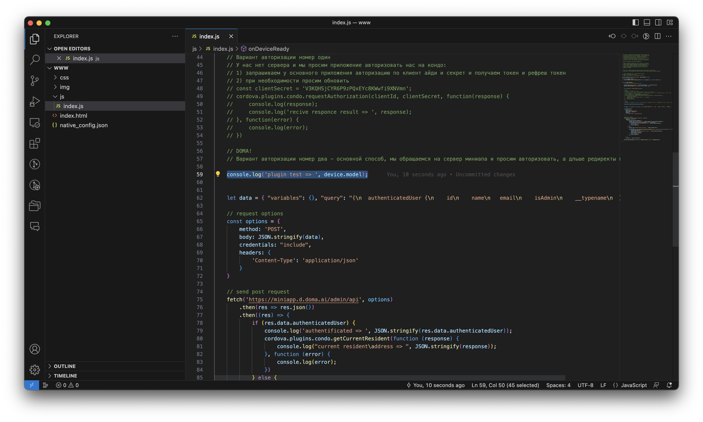
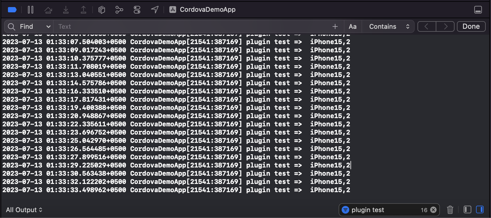

 ---
# Common methods. <a name="common_methods"></a>
- authorization

    `function requestServerAuthorizationByUrl(miniapp_server_init_auth_url, custom_params_reserver_for_future_use, success, error)`

    example:

    ```
    cordova.plugins.condo.requestServerAuthorizationByUrl('https://miniapp.d.doma.ai/oidc/auth', {}, function(response) {
        console.log('recive authorication result => ', JSON.stringify(response));
        window.location.reload();
    }, function(error) {
        console.log(error);
    });
    ```

- obtaining a current resident/address

    `function getCurrentResident(success, error)`

    example:

    ```
    cordova.plugins.condo.getCurrentResident(function(response) {
        console.log("current resident\address => ", JSON.stringify(response));
    }, function(error) {
        console.log(error);
    });
    ```


- application closing

    `function closeApplication(success, error)`

    example:

    ```
    cordova.plugins.condo.closeApplication(function(response) {}, function(error) {});
    ```


- application launch context (from notification)

    `function getLaunchContext(success, error)`

    example:

    ```
    cordova.plugins.condo.getLaunchContext(function(b2cAppContextString) {}, function(error) {});
    ```


- activation of additional events required for some inputs

    `function setInputsEnabled(enabled, success, error)`

    example:

    ```
    cordova.plugins.condo.setInputsEnabled(true, function(response) {}, function(error) {});
    ```

    Important! Don't forget to disable this back when the user leaves the screen where the inputs that required it are located.

    example:

    ```
    cordova.plugins.condo.setInputsEnabled(false, function(response) {}, function(error) {});
    ```
